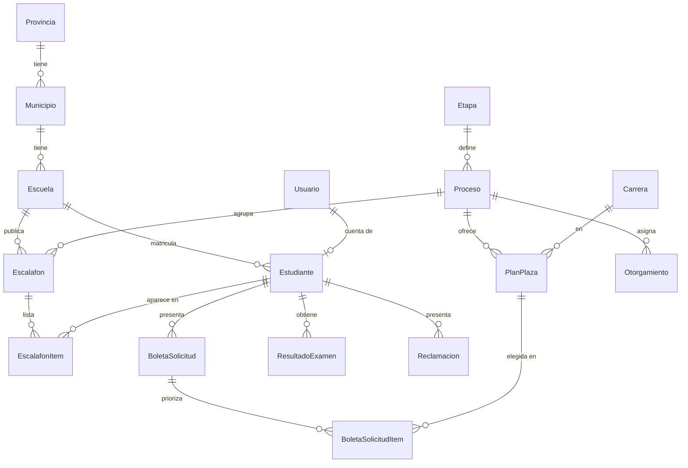
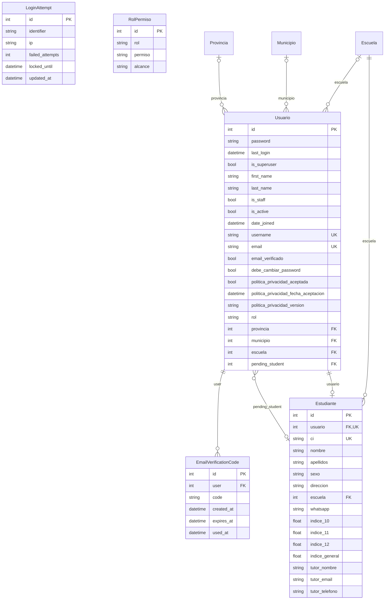
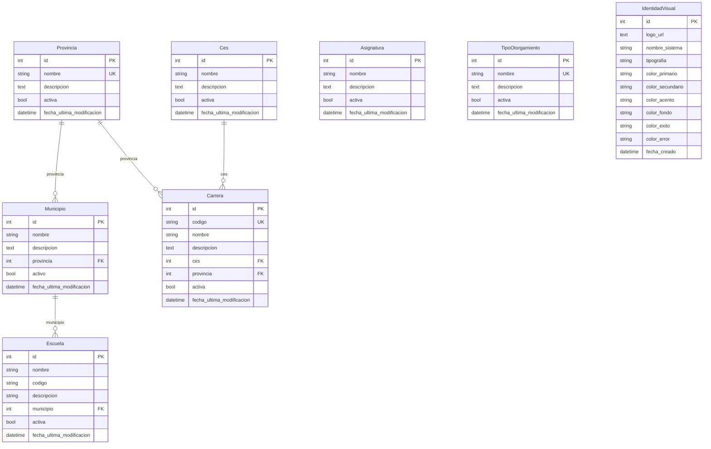
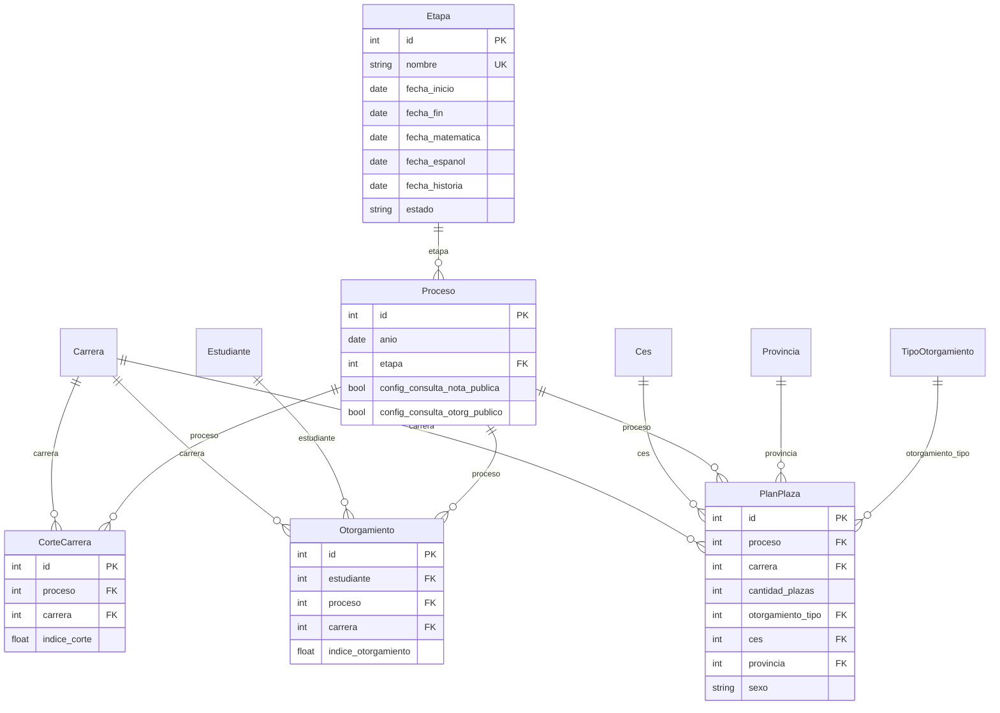
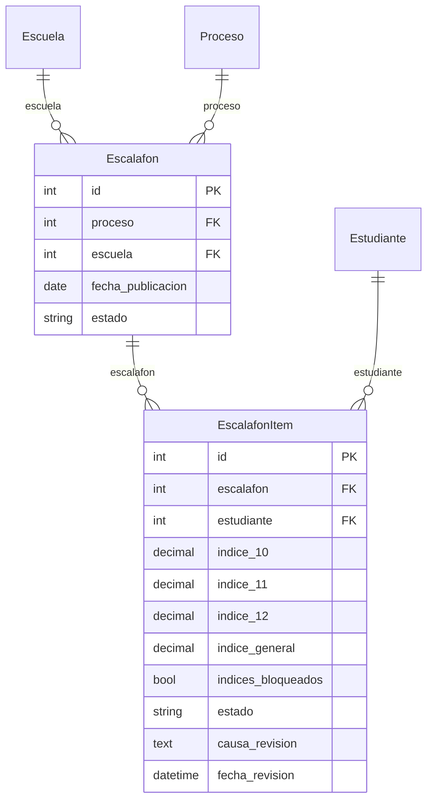
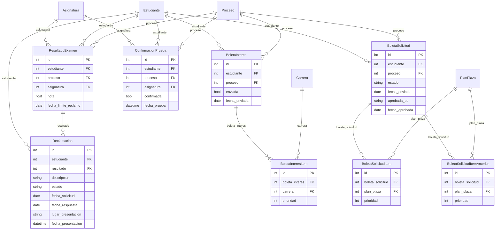
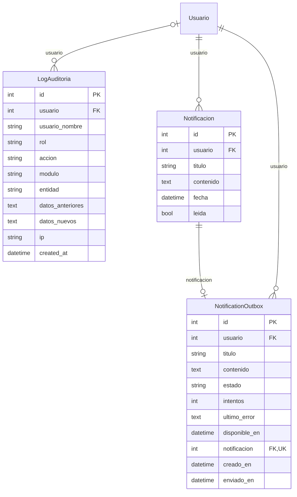

# Diagrama entidad-relación (ER)

Modelo de datos de IngresoSUP, generado a partir de los modelos reales de Django (`backend/apps/*/models.py`). Está en formato [Mermaid](https://mermaid.js.org/): GitHub y VS Code (con la extensión "Markdown Preview Mermaid Support") lo dibujan directamente.

**Cómo leerlo**

- Cada caja es una tabla y lista sus campos con su tipo. `PK` es la clave primaria, `FK` una clave foránea y `UK` un valor único.
- Las líneas son relaciones. En `A ||--o{ B` una fila de A se relaciona con muchas de B (por ejemplo, una escuela tiene muchos estudiantes). `|o` indica que la relación es opcional (el campo admite nulo) y `o|` que como mucho hay una fila relacionada (relación uno a uno).
- El diagrama está dividido por módulos para que sea legible. Una entidad de otro módulo que aparece vacía es solo una referencia: sus campos están en el módulo al que pertenece.
- Los campos con `FK` se guardan en la tabla como `<nombre>_id`.

## Vista general

Flujo principal: el territorio (provincia, municipio, escuela) organiza a los estudiantes y usuarios; cada **proceso** de ingreso pertenece a una **etapa** (escalafón, boleta de interés, plan de plazas y solicitud, confirmación de pruebas, resultados, otorgamiento); sobre cada proceso se publican escalafones, planes de plaza, boletas, resultados y otorgamientos.

## Cuentas y seguridad

App Django: `authentication`.

## Territorio, catálogos e identidad visual

App Django: `superadmin`.

## Proceso de ingreso: etapas, planes de plaza y otorgamiento

App Django: `gestion_provincial`.

## Escalafón por escuela

App Django: `gestion_escuela`.

## Boletas, confirmaciones y resultados del estudiante

App Django: `gestion_personal`.

## Auditoría y notificaciones

App Django: `core`.

## Cómo mantener este documento actualizado

El diagrama se generó leyendo los modelos con la introspección de Django (`apps.get_models()`, campos y relaciones reales). Cuando cambien los modelos, hay que regenerarlo o editar a mano las cajas afectadas. Si en algún momento se prefiere una imagen, se puede exportar con `python manage.py graph_models` (paquete `django-extensions`) o pegando estos bloques en el editor de <https://mermaid.live>.
